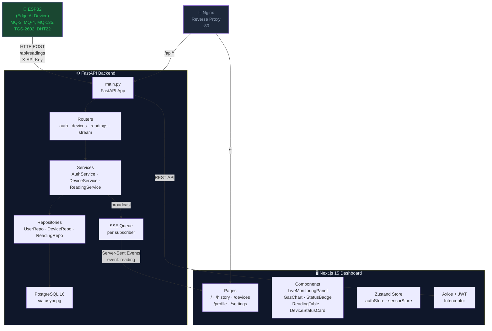
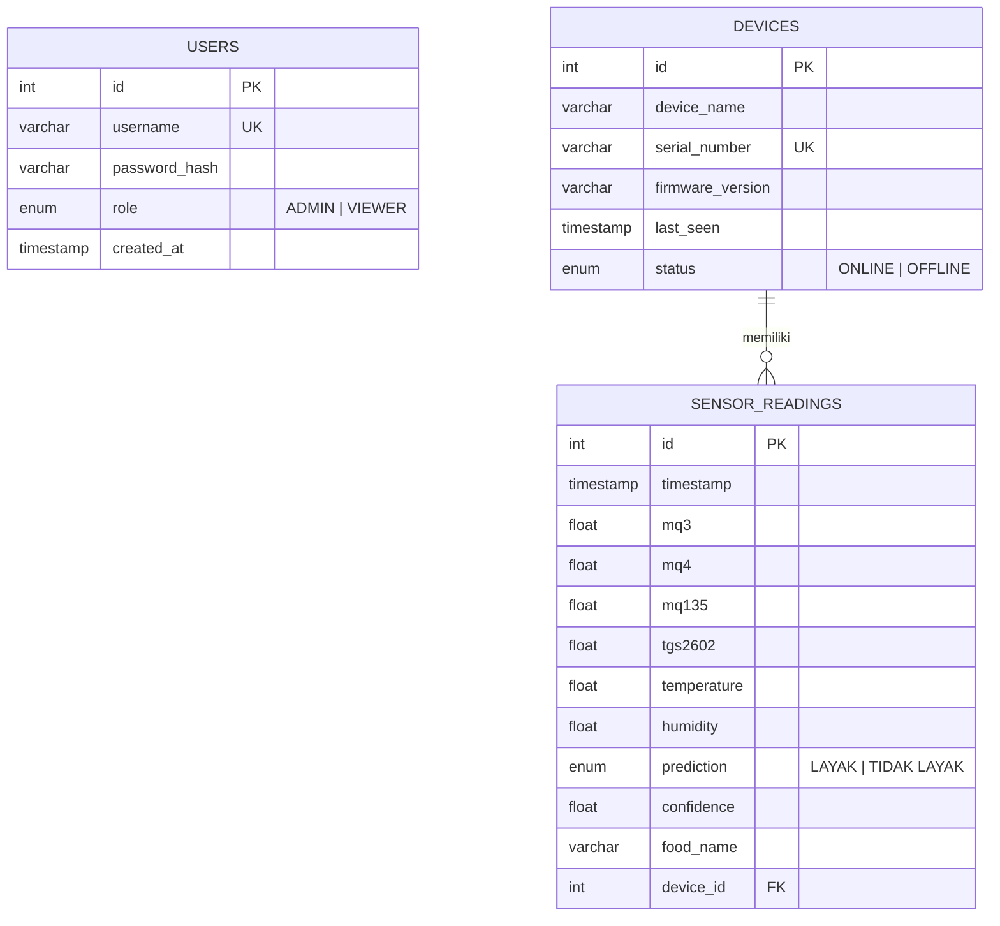
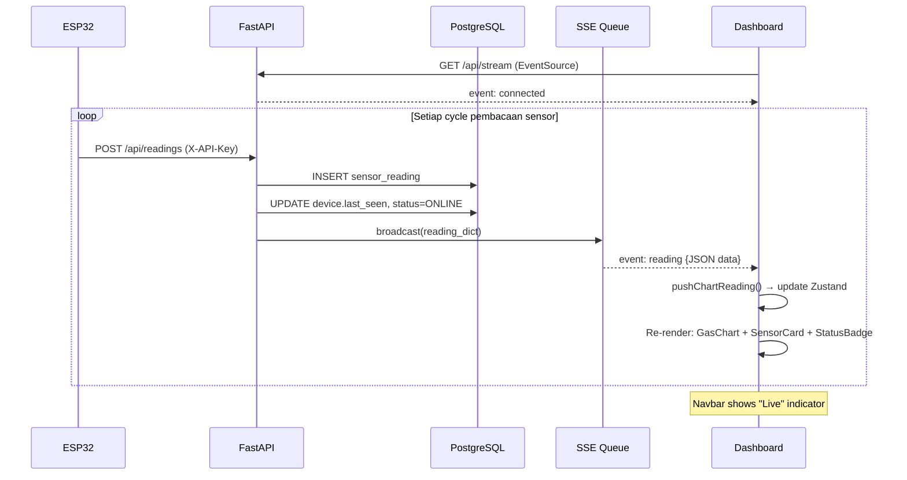
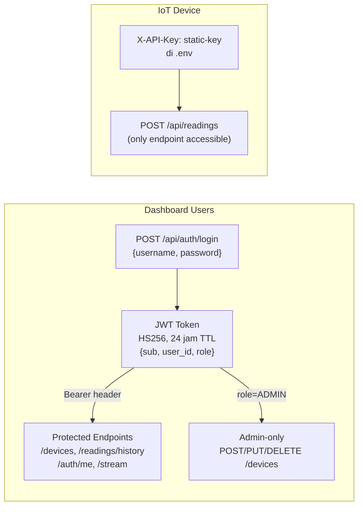
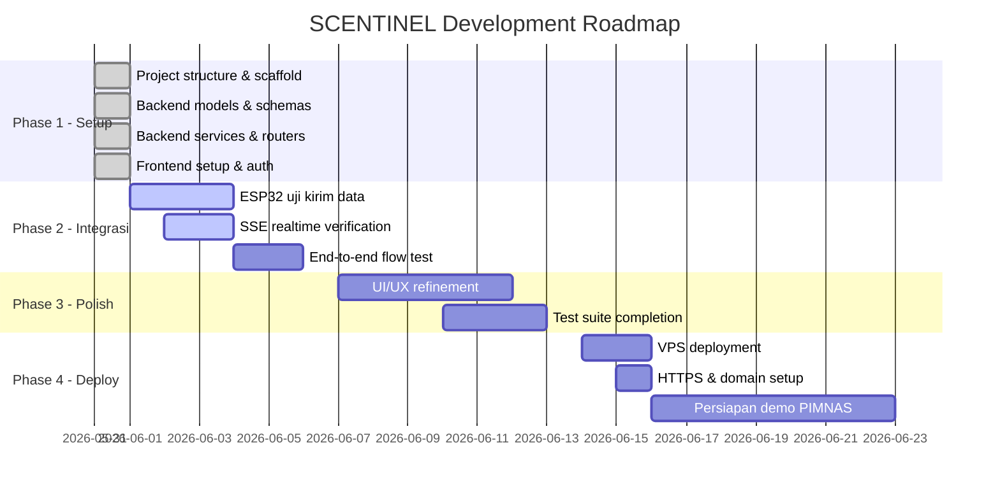

# 🌿 SCENTINEL — Comprehensive System Blueprint
> PKM-KC 2026 | Food Spoilage Detection System | Edge AI + IoT Monitoring

---

## 1. Arsitektur Sistem



---

## 2. Database ERD



---

## 3. Struktur File Lengkap (92 Files)

````carousel
### Backend (44 files)

```
backend/
├── app/
│   ├── main.py                    # FastAPI entry point, CORS, routers
│   ├── core/
│   │   ├── config.py              # Pydantic Settings dari .env
│   │   ├── security.py            # JWT create/decode, bcrypt
│   │   └── dependencies.py        # get_current_user, require_admin, ESP32 API key
│   ├── database/
│   │   ├── database.py            # Async engine, SessionLocal, Base
│   │   ├── seed.py                # Seed admin, viewer, default device
│   │   └── migrations.py          # Alembic CLI helper wrapper
│   ├── models/
│   │   ├── user.py                # User model (ADMIN | VIEWER)
│   │   ├── device.py              # Device model (ONLINE | OFFLINE)
│   │   └── reading.py             # SensorReading model (4 gas + 2 env + AI)
│   ├── schemas/
│   │   ├── auth.py                # LoginRequest, TokenResponse
│   │   ├── user.py                # UserCreate, UserResponse, ChangePassword
│   │   ├── device.py              # DeviceCreate, DeviceResponse, DeviceUpdate
│   │   └── reading.py             # ReadingCreate, ReadingResponse, Paginated
│   ├── repositories/
│   │   ├── user_repository.py     # CRUD users
│   │   ├── device_repository.py   # CRUD + update_last_seen + mark_offline
│   │   └── reading_repository.py  # create, latest, paginated history, export
│   ├── services/
│   │   ├── auth_service.py        # login, create_user, change_password
│   │   ├── device_service.py      # list, get, create, update, delete
│   │   └── reading_service.py     # ingest + SSE broadcast, latest, history, CSV
│   ├── routers/
│   │   ├── auth.py                # POST /login, GET /me, POST /change-password
│   │   ├── devices.py             # CRUD /devices (admin-protected writes)
│   │   ├── readings.py            # POST /readings, GET /latest /history /export
│   │   └── stream.py              # GET /stream → SSE EventStream
│   ├── utils/
│   │   ├── csv_export.py          # SensorReading list → CSV string
│   │   ├── helpers.py             # utcnow, formatters
│   │   └── constants.py           # threshold, labels, limits
│   └── tests/
│       ├── test_auth.py
│       ├── test_devices.py
│       └── test_readings.py
├── alembic/
│   ├── env.py                     # Async Alembic migration env
│   ├── script.py.mako             # Migration file template
│   └── versions/                  # Auto-generated migration files
├── alembic.ini
├── requirements.txt
├── Dockerfile
├── .env
└── README.md
```
<!-- slide -->
### Frontend (48 files)

```
frontend/
├── app/
│   ├── layout.tsx                 # Root layout: Inter font, dark, SEO, Toaster
│   ├── globals.css                # Tailwind + CSS vars, glass-card, animations
│   ├── loading.tsx                # Global loading spinner
│   ├── error.tsx                  # Error boundary dengan retry
│   ├── not-found.tsx              # 404 page
│   ├── (auth)/login/
│   │   └── page.tsx               # Login page: glassmorphism card + ambient glow
│   └── (dashboard)/
│       ├── layout.tsx             # Auth guard + Sidebar + Navbar wrapper
│       ├── page.tsx               # Dashboard: LiveMonitoringPanel
│       ├── history/page.tsx       # Riwayat: filter + table + export
│       ├── devices/page.tsx       # Perangkat: grid DeviceStatusCard
│       ├── profile/page.tsx       # Profil + change password
│       └── settings/page.tsx      # Info sistem
├── components/
│   ├── layout/
│   │   ├── Sidebar.tsx            # Nav links, user avatar, logout
│   │   └── Navbar.tsx             # SSE live/offline badge, last update time
│   ├── dashboard/
│   │   ├── LiveMonitoringPanel.tsx # SSE subscriber + prediction + cards + chart
│   │   ├── SensorCard.tsx         # Generic sensor value card dengan color variants
│   │   ├── GasChart.tsx           # Recharts LineChart 4 sensor realtime
│   │   ├── StatusBadge.tsx        # LAYAK/TIDAK LAYAK badge dengan confidence
│   │   └── DeviceStatusCard.tsx   # Device info + ONLINE/OFFLINE status
│   ├── history/
│   │   ├── ReadingTable.tsx        # Tabel semua sensor + pagination
│   │   ├── DateFilter.tsx         # Date range + prediction + food name filter
│   │   └── ExportButton.tsx       # CSV download dengan blob streaming
│   └── forms/
│       └── LoginForm.tsx          # RHF + Zod + password toggle
├── lib/
│   ├── api.ts                     # Axios instance + JWT interceptor + 401 redirect
│   ├── auth.ts                    # localStorage token helpers
│   ├── useSSE.ts                  # EventSource hook + exponential backoff reconnect
│   └── utils.ts                   # cn, formatDate, formatConfidence, isOnline
├── store/
│   ├── authStore.ts               # Zustand persist (user, token, login, logout)
│   └── sensorStore.ts             # Zustand live readings + 30-point chart buffer
├── hooks/
│   ├── useAuth.ts                 # Login/logout handlers + useRequireAuth guard
│   ├── useDevices.ts              # useDevices() + useDevice(id)
│   └── useReadings.ts             # useLatestReading() + useReadingHistory()
├── types/
│   ├── auth.ts                    # LoginRequest, TokenResponse, User, UserRole
│   ├── device.ts                  # Device, DeviceStatus, DeviceCreate
│   └── reading.ts                 # SensorReading, ReadingLatest, Paginated
├── middleware.ts                  # Route protection via cookie check
├── next.config.ts
├── tailwind.config.ts             # Brand colors: fresh (green) + spoiled (red)
├── tsconfig.json                  # Strict mode + path aliases
├── postcss.config.js
├── Dockerfile                     # Multi-stage standalone build
├── .env.local
└── README.md
```
<!-- slide -->
### Infrastructure (6 files)

```
scentinel/
├── docker-compose.yml   # 4 services: db, backend, frontend, nginx
├── nginx/
│   ├── nginx.conf       # Worker, gzip, performance settings
│   └── default.conf     # Proxy rules + SSE buffering disabled
├── .env.example         # Template semua environment variables
├── .gitignore
└── README.md            # Full project docs + ESP32 code example
```
````

---

## 4. API Reference Lengkap

| Method | Endpoint | Auth | Request Body | Response |
|--------|----------|------|-------------|----------|
| `POST` | `/api/auth/login` | — | `{username, password}` | `{access_token, role, ...}` |
| `GET` | `/api/auth/me` | JWT | — | `{id, username, role, created_at}` |
| `POST` | `/api/auth/change-password` | JWT | `{current_password, new_password}` | `{message}` |
| `GET` | `/api/devices/` | JWT | — | `Device[]` |
| `GET` | `/api/devices/{id}` | JWT | — | `Device` |
| `POST` | `/api/devices/` | JWT (ADMIN) | `{device_name, serial_number, firmware_version}` | `Device` 201 |
| `PUT` | `/api/devices/{id}` | JWT (ADMIN) | `DeviceUpdate` | `Device` |
| `DELETE` | `/api/devices/{id}` | JWT (ADMIN) | — | `{message}` |
| `POST` | `/api/readings/` | `X-API-Key` | `ReadingCreate` | `SensorReading` 201 |
| `GET` | `/api/readings/latest` | JWT | `?device_id=` | `ReadingLatest` |
| `GET` | `/api/readings/history` | JWT | `?device_id&start_date&end_date&prediction&food_name&limit&offset` | `PaginatedReadings` |
| `GET` | `/api/readings/export` | JWT | `?device_id&start_date&end_date` | `CSV file` |
| `GET` | `/api/stream` | — | — | `text/event-stream` |
| `GET` | `/api/health` | — | — | `{status: "ok"}` |

### SSE Event Format

```
event: connected
data: {"message": "SSE connected to SCENTINEL"}

event: reading
data: {"id":42,"timestamp":"2026-05-31T14:30:00Z","mq3":123.4,"mq4":200.1,...,"prediction":"LAYAK","confidence":0.9523}

: keepalive   (every 15 seconds)
```

---

## 5. Alur Data End-to-End



---

## 6. Security Design



> [!IMPORTANT]
> Ganti `SECRET_KEY` dan `ESP32_API_KEY` di `.env` sebelum deployment. Jangan gunakan nilai default!

---

## 7. Deployment Guide VPS Ubuntu

### A. Persiapan Server

```bash
# 1. Update & install Docker
sudo apt update && sudo apt upgrade -y
curl -fsSL https://get.docker.com | sh
sudo usermod -aG docker $USER && newgrp docker

# 2. Install Docker Compose plugin
sudo apt install docker-compose-plugin -y

# 3. Verifikasi
docker --version
docker compose version
```

### B. Deploy Aplikasi

```bash
# 1. Clone project
git clone https://github.com/your-org/scentinel.git /opt/scentinel
cd /opt/scentinel

# 2. Konfigurasi environment
cp .env.example .env
nano .env
# Isi nilai berikut:
# SECRET_KEY=<generate dengan: openssl rand -hex 32>
# ESP32_API_KEY=<buat API key unik>
# POSTGRES_PASSWORD=<password kuat>

# 3. Build & jalankan
docker compose up -d --build

# 4. Verifikasi
docker compose ps
docker compose logs backend --tail=50
```

### C. Setup Domain & HTTPS

```bash
# Install Certbot
sudo apt install certbot python3-certbot-nginx -y

# Buat SSL certificate
sudo certbot --nginx -d scentinel.yourdomain.com

# Update nginx/default.conf untuk listen 443
# Auto-renew (crontab)
echo "0 12 * * * root certbot renew --quiet" | sudo tee /etc/cron.d/certbot
```

### D. Maintenance Commands

```bash
# Cek logs realtime
docker compose logs -f

# Restart service
docker compose restart backend

# Backup database
docker compose exec db pg_dump -U scentinel scentinel_db > backup_$(date +%Y%m%d).sql

# Update dan redeploy
git pull && docker compose up -d --build

# Jalankan migrasi manual
docker compose exec backend alembic upgrade head

# Masuk ke shell backend
docker compose exec backend bash
```

---

## 8. Roadmap Implementasi



---

## 9. Best Practices PKM-KC

### Keamanan
- [ ] Ganti semua secret keys di `.env` sebelum demo
- [ ] Aktifkan HTTPS (Let's Encrypt) di VPS
- [ ] Jangan pernah commit `.env` ke Git (sudah di `.gitignore`)
- [ ] Rotate `ESP32_API_KEY` jika bocor

### Performa
- [ ] Nginx sudah dikonfigurasi dengan gzip dan keepalive
- [ ] Database pooling dengan `pool_size=10, max_overflow=20`
- [ ] SSE menggunakan asyncio Queue (non-blocking)
- [ ] Recharts menggunakan `dot={false}` untuk performa chart realtime
- [ ] Zustand `chartData` dibatasi 30 titik terakhir

### Demo & Presentasi PIMNAS
- [ ] Seed data yang realistis: minimal 50 pembacaan per makanan
- [ ] Siapkan ESP32 dengan 2 sampel: `LAYAK` dan `TIDAK LAYAK`
- [ ] Tampilkan live demo SSE dengan confidence score tinggi (>90%)
- [ ] Export CSV demonstrasi dengan `ExportButton`
- [ ] Pastikan device status `ONLINE` saat demo

### Kode Quality
- [ ] TypeScript strict mode aktif di semua file
- [ ] Tidak ada business logic di dalam React component (pakai hooks/services)
- [ ] Repository pattern memisahkan DB access dari business logic
- [ ] Semua endpoint punya respons bertipe (Pydantic schema)

---

## 10. Environment Variables Reference

### Root `.env` (Docker Compose)
```env
POSTGRES_USER=scentinel
POSTGRES_PASSWORD=<kuat, min 16 char>
POSTGRES_DB=scentinel_db
SECRET_KEY=<openssl rand -hex 32>
ESP32_API_KEY=<string unik, contoh: SCT-2026-XXXXXXXX>
```

### Backend `backend/.env`
```env
DATABASE_URL=postgresql+asyncpg://scentinel:<password>@db:5432/scentinel_db
SECRET_KEY=<sama dengan root>
ALGORITHM=HS256
ACCESS_TOKEN_EXPIRE_MINUTES=1440
ESP32_API_KEY=<sama dengan root>
CORS_ORIGINS=["http://localhost","https://yourdomain.com"]
```

### Frontend `frontend/.env.local`
```env
NEXT_PUBLIC_API_URL=https://yourdomain.com/api
NEXT_PUBLIC_SSE_URL=https://yourdomain.com/api/stream
```

---

## 11. Struktur Dashboard untuk PIMNAS

````carousel
### Halaman Dashboard (/)
**Live Monitoring Panel:**
- 🟢/🔴 **Hasil Deteksi AI** besar (LAYAK/TIDAK LAYAK) + confidence %
- 📊 6 **SensorCard**: MQ-3, MQ-4, MQ-135, TGS-2602, Suhu, Kelembapan
- 📈 **GasChart**: 4-line realtime chart (30 titik terakhir)
- 🔴 **Live badge** di Navbar berkedip saat SSE aktif
- ⏱️ **Last update** timestamp relative (mis. "2 detik lalu")

### Halaman Riwayat (/history)
**Fitur lengkap:**
- Filter: tanggal dari-sampai, hasil deteksi, nama makanan
- Tabel: semua 10 kolom sensor + StatusBadge + confidence
- Pagination: navigasi halaman dengan total count
- Export CSV: tombol download data terfilter

### Halaman Perangkat (/devices)
**DeviceStatusCard per perangkat:**
- Nama & serial number
- Status ONLINE (hijau) / OFFLINE (abu)
- Versi firmware
- Waktu terakhir aktif (relative)

### Halaman Profil (/profile)
- Info user: username, role, tanggal bergabung
- Form ganti password dengan validasi Zod
````

---

> [!TIP]
> Untuk demo PKP2/PIMNAS yang optimal: jalankan ESP32 dengan interval pengiriman 3-5 detik agar grafik realtime terlihat bergerak aktif. Siapkan 2 sampel makanan: segar (LAYAK ~95%) dan busuk (TIDAK LAYAK ~92%) untuk memperlihatkan kedua prediksi.
